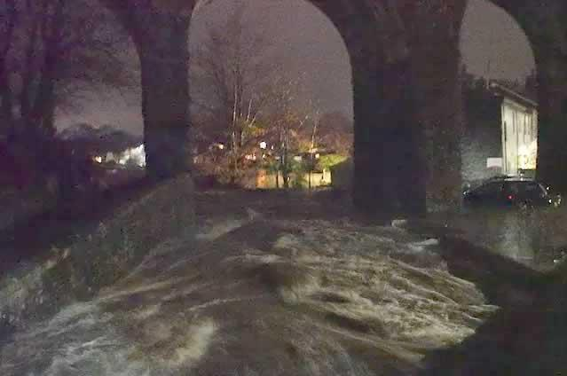
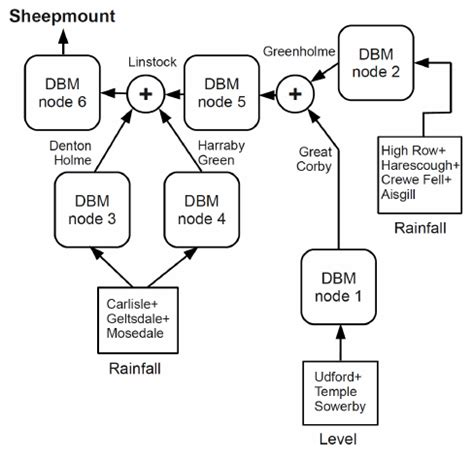

# Why?

## Challange

- Is there available Open Data?
  - No cost
  - Commercial use
  - API access
  - High temporal resolution
- Can we scale the DBM methodology
- Status Quo

{width=100%}

# Data

## Observed Gauge Values
  - NRT: OK (EA, NRW, SEPA)
  - Archive: Mixed (EA historic)
  - Only starting to get flow

## Catchment Data
  - OS: DEM & Channel structure
  - NFRA: Outlines under a different license
  
## Forecast Rainfall
  - Global
    - NRT & archive
  - High resolution
    - Met Office: API to limited, no public archive
	- KNMI, DWD, Meteofrance: NRT, no archive
  
# DBM modelling

## A Model Unit

\[x_{t} = \sum_{j=1:n} \frac{b_{0,j} +  \ldots +
  b_{m_{j},j}L^{m_{j}}}{1 - a_{0}L - \ldots - a_{n}L^{n}}
  f_{j}\left(x_{t-d_{j}}\right)u_{t-d_{j}}
\]
\[y_{t} = x_{t} + \eta_{t}\]

- Improvements
  - Feedback through non-linear function
  - Non-linear Filtering
  
{width=100%}

## A Forest of Trees

- Couple down the river network
- Cascade forecasts
- 615 level gauges
- ~1000 rainfall gauges

{width=100%}

## Coverage & Performance

Catchments
{width=100%}
NSE of models
{width=100%}

# Dissemination

## Web

{width=100%}

- API: https://flood.waternumbers.com/
- Veiwer: https://waternumbers.github.io/ukg
- Code: https://github.com/waternumbers/ukg
- paul@waternumbers.co.uk

