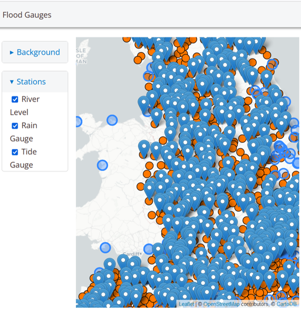

# Why?

## Challenge

- Is there available Open Data?
   - No cost
   - Commercial use
  - API access
  - High temporal resolution
- Does the DBM methodology scale?
- Status Quo

{width=100%}

# Data

## Observed Data

### Gauge Data

|          | NRT                                                                                            | Archive                                                            |
|---------:|:-----------------------------------------------------------------------------------------------|--------------------------------------------------------------------|
|    Stage | EA, NRW, SEPA | EA, NRW, SEPA |
|    Flow | EA, NRW, SEPA | EA, NRW, SEPA |
|    Rainfall | EA, NRW, SEPA | EA, NRW, SEPA, UKMO |

### Catchment Data

- Lots of sources
- Ordnance Survey
  - DEM
  - Channel Network

 

  
## Forecast Rainfall

<video width="75%" controls> 
<source src="images/Media1.mp4" type="video/mp4">
</video>

|                                     | NRT    | Archive      |
|------------------------------------:|--------|--------------|
|    Radar | Image  | (No)         |
| UKMO UKV | No (£) | No (License) |
|      KNMI | Yes    | No           |
|       DWD | Yes    | No           |
|                                NCEP | Yes    | Yes          |
|                               ECMWF | Yes    | Yes          |

Resolution: UK, European, Global

# Data Based Mechanistic Modelling

## A Model Unit

\[x_{t} = x_{min} + \sum_{j=1:n} \frac{b_{0,j} +  \ldots +
  b_{m_{j},j}L^{m_{j}}}{1 - a_{0}L - \ldots - a_{n}L^{n}}
  f_{j}\left(x_{t-d_{j}}\right)u_{t-d_{j}}
\]
\[y_{t} = x_{t} + \eta_{t}\]

Improvements

- Feedback through non-linear function
- Non-linear Filtering

 
 
 
   
{width=100%}

## A Forest of Trees

### Catchment Tree

{width=95%}

- Identify 615 key level gauge
  - River network -> Trees
  - Add new gauges as spurs
- Map ~1000 Rain gauges by
  - Defining catchments
  - Theissen Polygon

## Coverage & Performance

Catchments
{width=90%}

NSE of models
{width=100%}

# Implementation

## An Open System

{width=100%}

**Alpha: Not stable**

Web Services 

- Providing APIs

Scheduled jobs

- Data scrapping
- Model Simulation

 
 
https://waternumbers.github.io/ukg

## The Future

- Can you build your own NFFS? *Yes*
- Can you run your own NFFS? *Yes but more compromises*

- Document and stabalise
- Include (Ensemble) meteorological forecasts
  - Evaluate forecast performance
- Expand over the UK
- Incorporate sensors from other sources

https://waternumbers.github.io/ukg

paul@waternumbers.co.uk

